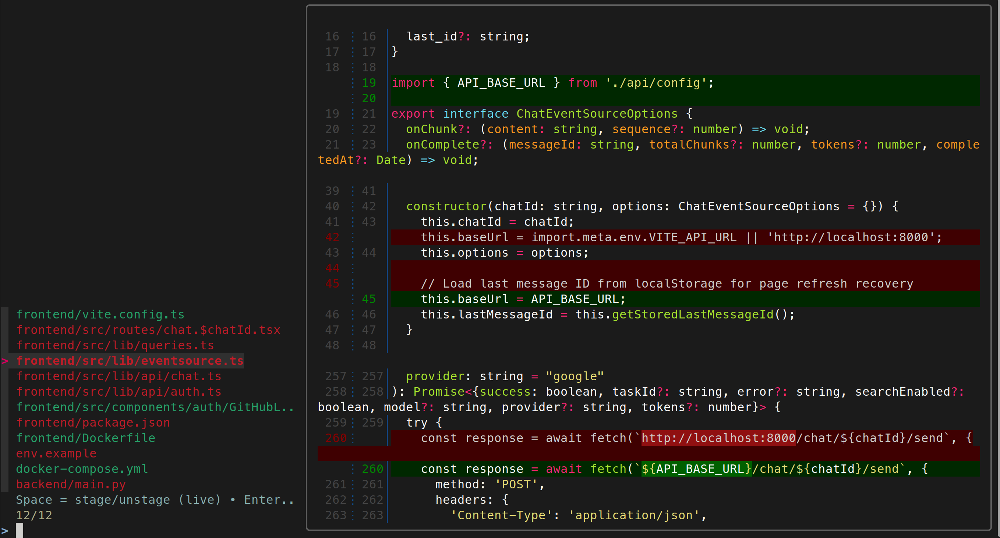

# Interactive Lazy Git FZF + Delta Tool

This repository provides a **Bash-based interactive tool** for viewing and staging/unstaging Git changes using **`fzf`** and **`delta`**.

---

## Features

* Interactive file selection with `fzf`.
* Split-screen interface: left panel shows files (1/3 width), right panel shows diffs (2/3 width).
* Color-coded file status:

  * Green (`S`) → Staged
  * Red (`U`) → Unstaged
  * Yellow (`B`) → Partially staged/modified
* Preview diffs using `delta` if installed; falls back to `git diff` or file contents.
* Space-bar to stage/unstage files live.
* Dynamic inclusion of untracked files in search when typing in `fzf`.

---

## Requirements

* `git`
* `fzf`
* `delta` (optional but recommended for nicer diffs)
* Optional fallback: `bat` for file previews

---

## Usage

Run the script inside a Git repository:

```bash
./git-add-picker
```

### Keyboard Shortcuts

| Key    | Action                                                          |
| ------ | --------------------------------------------------------------- |
| Space  | Stage / unstage the selected file                               |
| Enter  | Accept and exit the interface                                   |
| Typing | Filters files dynamically; includes untracked files when typing |

---

## How It Works

1. **Listing files:**
   Uses `git status --porcelain=v1` to generate a list of modified files, with status codes:

   * `S` → staged
   * `U` → unstaged
   * `B` → partially staged/modified

2. **Interactive selection:**
   The list is piped into `fzf` with color highlighting.

3. **Preview panel:**

   * Uses `delta` (if installed) to display staged/unstaged diffs.
   * Falls back to `git diff` or `bat`/`cat` for files without diffs.

4. **Live staging/unstaging:**
   Pressing `Space` stages/unstages the selected file and reloads the list dynamically.

5. **Dynamic untracked file search:**

   * By default, only modified files are shown.
   * When typing in `fzf`, untracked files are included in the search results.

---

## Adding Screenshots

To include screenshots of the UI in this Markdown file:

1. Place your screenshot file (e.g., `screenshot.png`) in the repository.
2. Add a Markdown image reference where you want it displayed:

```markdown

```

Example:

```markdown
## Example UI


```

---

## Notes

* Must run inside a Git repository.
* Uses temporary scripts internally; cleans them up automatically.
* Split-screen preview is controlled with:

```bash
--preview-window=right:70%:wrap
```
